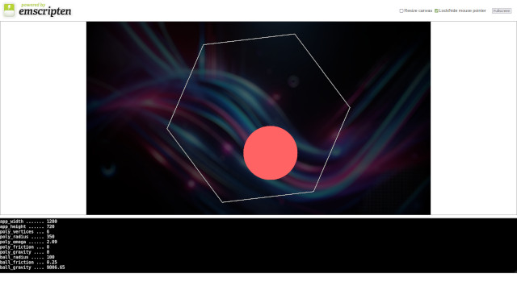

# BOUNCING-BALL

A bouncing ball in a spinning polygon written in C++ and [SDL2](https://www.libsdl.org/).

## DESCRIPTION

This program written in C++ and SDL2 shows a ball bouncing inside a spinning polygon.

The ball is affected by gravity and friction, and bounces off the rotating walls quite realistically.

## HOW TO BUILD

### Install the dependencies

Under Debian and derivatives (Ubuntu, Mint, ...):

```
apt-get install build-essential libsdl2-dev libsdl2-image-dev
```

In order to build the [WASM](https://en.wikipedia.org/wiki/WebAssembly) version, you must install [Emscripten](https://emscripten.org/) on your system.

### Build the project

To build the project, simply type:

```
make
```

You can also use the `-j` option if you want to build in parallel with `GNU make`:

```
make -j{number-of-jobs}
```

To build the WASM version, please use `Makefile.wasm`:

```
make -f Makefile.wasm
```

### Clean the project

To clean the project, simply type:

```
make clean
```

To clean the WASM version, please use `Makefile.wasm`:

```
make -f Makefile.wasm clean
```

## HOW TO RUN

### Usage

Command line options:

```
Usage: bouncing-ball.bin [OPTIONS...] [SHAPE] [PLANET]

Options:

  -h, --help                    display this help and exit

Shapes:

  triangle, square, pentagon,
  hexagon, heptagon, octagon,
  nonagon, decagon, hendecagon,
  dodecagon

Planets:
  mercury, venus, earth, mars,
  moon


Controls:

h ................ toggle help overlay
u ................ toggle back underlay
r ................ reset simulation
q ................ quit the program
up ............... increase polygon vertices
down ............. decrease polygon vertices
left ............. accelerate polygon to the left
right ............ accelerate polygon to the right
shift-left ....... accelerate polygon faster to the left
shift-right ...... accelerate polygon faster to the right
button ........... modify polygon position
wheel ............ modify polygon radius
shift-button ..... modify ball position
shift-wheel ...... modify ball radius
escape ........... quit the program

```

### Run

```
./bouncing-ball.bin
```

### Run the WASM version

To run the WASM version, you can use the Python built-in http server:

```
python3 -m http.server
```

Then open your browser and point to [localhost/bouncing-ball.html](http://127.0.0.1:8000/bouncing-ball.html)

### Test in your browser

You can play with this project directly in your browser [here](https://www.emaxilde.net/assets/games/bouncing-ball/bouncing-ball.html).



## LICENSE

The source code is released under the terms of the GNU General Public License 2.0.

```
This program is free software: you can redistribute it and/or modify
it under the terms of the GNU General Public License as published by
the Free Software Foundation, either version 2 of the License, or
(at your option) any later version.

This program is distributed in the hope that it will be useful,
but WITHOUT ANY WARRANTY; without even the implied warranty of
MERCHANTABILITY or FITNESS FOR A PARTICULAR PURPOSE.  See the
GNU General Public License for more details.

You should have received a copy of the GNU General Public License
along with this program.  If not, see <http://www.gnu.org/licenses/>
```

